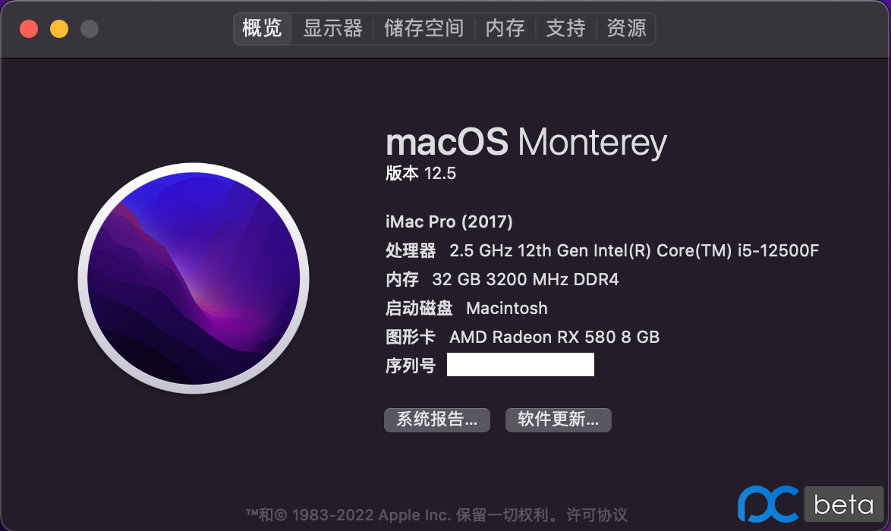
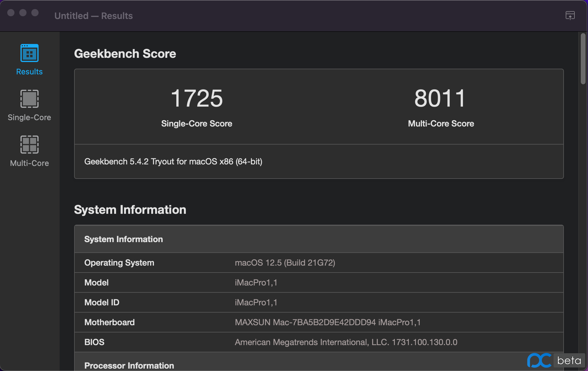

# Hackintosh-12400F-MAXSUN-B660M-CHALLENGER
## 12400F+铭瑄B660M挑战者+BCM94352z+Monterey12.5

2837元的12代配置黑苹果双系统，不知道大家觉得性价比如何

|配置|型号|价格|
|-|-|-|
|CPU|12代i5-12400F|拼爹868元|
|主板|铭瑄B660M挑战者|拼爹450元|
|显卡|蓝宝石RX580超白金|海鲜600元|
|内存|铭瑄16G 3200|拼爹223元|
|硬盘|海康威视CC500|拼爹227元|
|电源|长城P600铜牌600W|拼爹201元|
|散热器|零下三十度无光|拼爹48元|
|机箱|暗夜猎手5黑色+3日食灯风扇|拼爹88元|
|蓝牙+WIFI|BCM94352z|拼爹82元|
||NGFF转PCIE双天线转接板|拼爹21元|
||PCIE延长线|拼爹29元|

 
 

